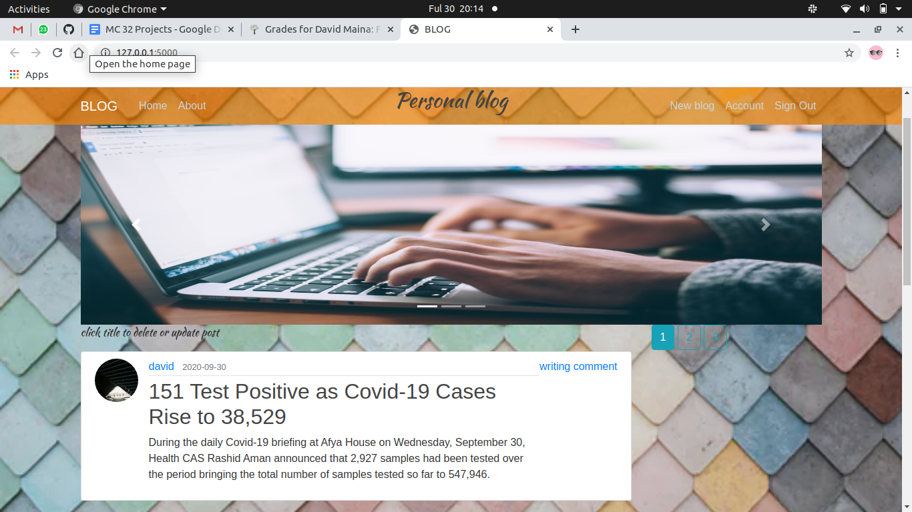

# Pitch Application
 <!--  -->


# DESCRIPTION

The past few weeks have proven that you can learn anything. And a great way to solidify your knowledge is to teach it to other people. There is no better way to express your ideas and opinions than with a personal blog.

## User Story

1. As a user, I would like to view the blog posts on the site
1. As a user, I would like to comment on blog posts
1. As a user, I would like to view the most recent posts
1. As a user, I would like to an email alert when a new post is made by joining a subscription.
1. As a user, I would like to see random quotes on the site
1. As a writer, I would like to sign in to the blog.
1. As a writer, I would also like to create a blog from the application.
1. As a writer, I would like to delete comments that I find insulting or degrading.
1. As a writer, I would like to update or delete blogs I have created.
## Known Bugs
If you find a bug (the website couldn't handle the query and / or gave undesired results), kindly open an issue here by including your search query and the expected result.

If you'd like to request a new function, feel free to do so by opening an issue here. Please include sample queries and their corresponding results
## Specifications

## setup /Installation Requirements
First clone the repo
   ```$ git clone  ```

After cloning, navigate to the project:
   `` $ cd news-flask``

Then install all the requirements through pip:
   ```$ pip install -r requirements.txt ```

Make the file executable:
   ```$ chmod +x start.sh```

Run the application:
   ```$ ./start.sh ```

Now navigate to your browser at: ```localhost:5000```


## Technologies Used
* Python
* Flask
* HTML5
* CSS3
* Bootstrap

## Support and contact details
call me on

:0713275530

<!-- :0778378174 -->
 
 :davidmaina085@gmail.com

## License

[MIT License](LICENSE.md)
Copyright (c) [2020] [David Kiiru]